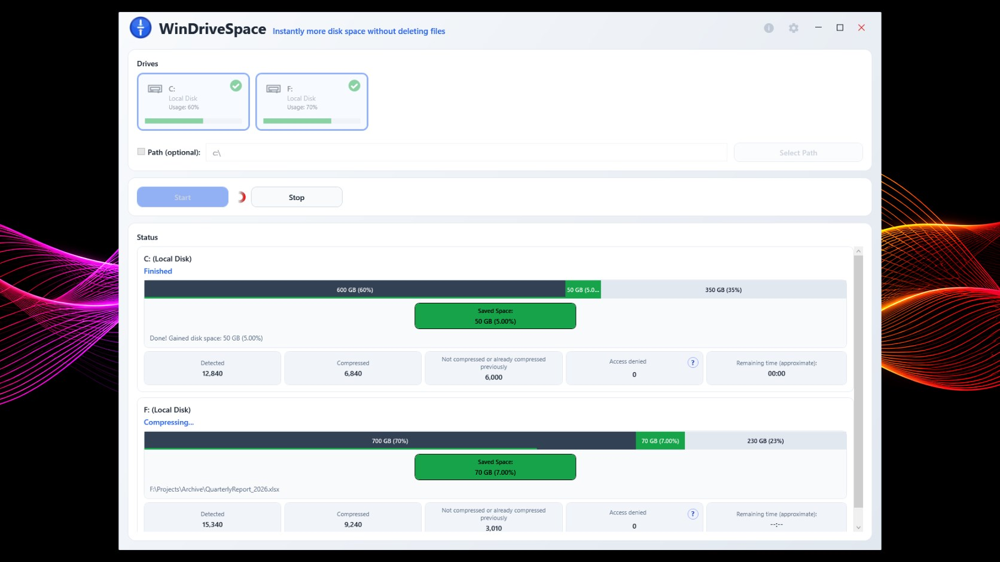

# WinDriveSpace

## Download and run WinDriveSpace.

Download the Windows application from the [latest GitHub release](https://github.com/Appshines/WinDriveSpace/releases/latest), or visit the [Microsoft Store](https://apps.microsoft.com/detail/9pfmlksl83z2).

The GitHub download is a single executable file that includes all 106 languages. The app does not require installation, but .NET Framework 4.8 must be available on your computer. It extracts its runtime files temporarily and removes them when you exit normally. Settings remain in your user profile.

To update this edition, close the app and replace the executable with the new version. Automatic updates are disabled in the single-file edition. The executable is not digitally signed. Each release includes a SHA-256 checksum file for download verification.

## About WinDriveSpace

WinDriveSpace helps you gain additional disk space in a simple and safe way.

No files are deleted. Instead, the program compresses existing files so they take up less space on your hard drive. WinDriveSpace uses the file compression functions already built into Windows. As a user, nothing changes in your daily workflow: you can continue working with your files as usual.

Depending on file type and system environment, the reduced data volume can also help decrease read and write operations. However, the main benefit is the space savings.

WinDriveSpace uses an intelligent process that only compresses files where storage requirements are actually reduced. Very small files or files that are already internally compressed are deliberately skipped, since additional compression usually offers no benefit here.

Files where compression would be undesirable or detrimental also remain uncompressed. This includes, for example, SQL database files or virtual machine disk images.

Note: The application requires elevated permissions (administrator rights) to perform some core functions.

